# 📊 Nexus Commerce API - Projektdiagramme

## Inhaltsverzeichnis

1. [Übersicht](#übersicht)
2. [System-Architektur](#system-architektur)
3. [Datenbank-Struktur](#datenbank-struktur)
4. [API-Flussdiagramme](#api-flussdiagramme)
5. [Authentifizierung](#authentifizierung)
6. [Deployment-Architektur](#deployment-architektur)
7. [Komponenten-Interaktionen](#komponenten-interaktionen)

---

## Übersicht

Dieses Dokument enthält detaillierte Diagramme und Erklärungen zur **Nexus Commerce API**. Jedes Diagramm zeigt einen wichtigen Aspekt des Systems, um das Verständnis der Architektur und des Datenflusses zu erleichtern.

---

## System-Architektur

### Schichtenarchitektur (Layered Architecture)

```mermaid
graph TB
    subgraph "Client Layer"
        A[Web Browser]
        B[Mobile App]
        C[API Client/Postman]
    end
    
    subgraph "API Gateway Layer"
        D[Rate Limiter]
        E[CORS Handler]
        F[Helmet Security]
        G[Request Logger]
    end
    
    subgraph "Routing Layer"
        H[/api/v1/users]
        I[/api/v1/products]
        J[/api/v1/orders]
        K[/api/v1/health]
    end
    
    subgraph "Middleware Layer"
        L[Authentication JWT]
        M[Authorization RBAC]
        N[Input Validation]
        O[Error Handler]
    end
    
    subgraph "Controller Layer"
        P[User Controller]
        Q[Product Controller]
        R[Order Controller]
    end
    
    subgraph "Service Layer"
        S[User Service]
        T[Product Service]
        U[Order Service]
    end
    
    subgraph "Data Layer"
        V[(MySQL Database)]
        W[(Redis Cache)]
        X[Cloudinary Storage]
    end
    
    A --> D
    B --> D
    C --> D
    
    D --> E
    E --> F
    F --> G
    
    G --> H
    G --> I
    G --> J
    G --> K
    
    H --> L
    I --> L
    J --> L
    
    L --> M
    M --> N
    
    N --> P
    N --> Q
    N --> R
    
    P --> S
    Q --> T
    R --> U
    
    S --> V
    T --> V
    U --> V
    
    T --> W
    T --> X
    
    O -.-> P
    O -.-> Q
    O -.-> R
```

### Erklärung der Schichten

1. **Client Layer**: Verschiedene Clients (Browser, Mobile Apps, API-Tools), die mit der API kommunizieren.

2. **API Gateway Layer**: Erste Verteidigungslinie mit:
   - **Rate Limiter**: Schützt vor DDoS-Angriffen (100 req/15min für API, 5 req/h für Auth)
   - **CORS**: Kontrolliert Cross-Origin-Zugriffe
   - **Helmet**: Setzt Sicherheits-Header
   - **Logger**: Protokolliert alle Anfragen mit Winston

3. **Routing Layer**: Organisiert API-Endpunkte nach Ressourcentypen (Users, Products, Orders).

4. **Middleware Layer**: 
   - **Authentication**: JWT-Token-Validierung
   - **Authorization**: Rollenbasierte Zugriffskontrolle (Customer/Admin)
   - **Validation**: Input-Validierung mit express-validator
   - **Error Handler**: Zentrale Fehlerbehandlung

5. **Controller Layer**: Verarbeitet HTTP-Requests und -Responses.

6. **Service Layer**: Enthält die Geschäftslogik und Datenbank-Transaktionen.

7. **Data Layer**: Persistierung und externe Dienste.

---

## Datenbank-Struktur

### Entity-Relationship-Diagramm (ERD)

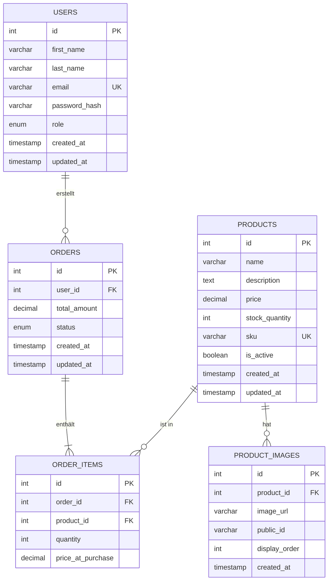

### Datenbank-Beziehungen

1. **USERS → ORDERS** (1:N)
   - Ein Benutzer kann mehrere Bestellungen haben
   - Jede Bestellung gehört zu genau einem Benutzer

2. **ORDERS → ORDER_ITEMS** (1:N)
   - Eine Bestellung enthält mindestens ein Bestellelement
   - Jedes Bestellelement gehört zu genau einer Bestellung

3. **PRODUCTS → ORDER_ITEMS** (1:N)
   - Ein Produkt kann in mehreren Bestellungen vorkommen
   - Preis wird zum Bestellzeitpunkt gespeichert (`price_at_purchase`)

4. **PRODUCTS → PRODUCT_IMAGES** (1:N)
   - Ein Produkt kann mehrere Bilder haben (max. 5)
   - Bilder werden in Cloudinary gespeichert

### Wichtige Felder

- **users.role**: `ENUM('customer', 'admin')` - Definiert Berechtigungen
- **users.email**: `UNIQUE` - Jede E-Mail nur einmal
- **products.sku**: `UNIQUE` - Stock Keeping Unit für Inventar
- **products.is_active**: `BOOLEAN` - Produkt sichtbar/unsichtbar
- **orders.status**: `ENUM('pending', 'processing', 'shipped', 'delivered', 'cancelled')`

---

## API-Flussdiagramme

### Benutzer-Registrierung

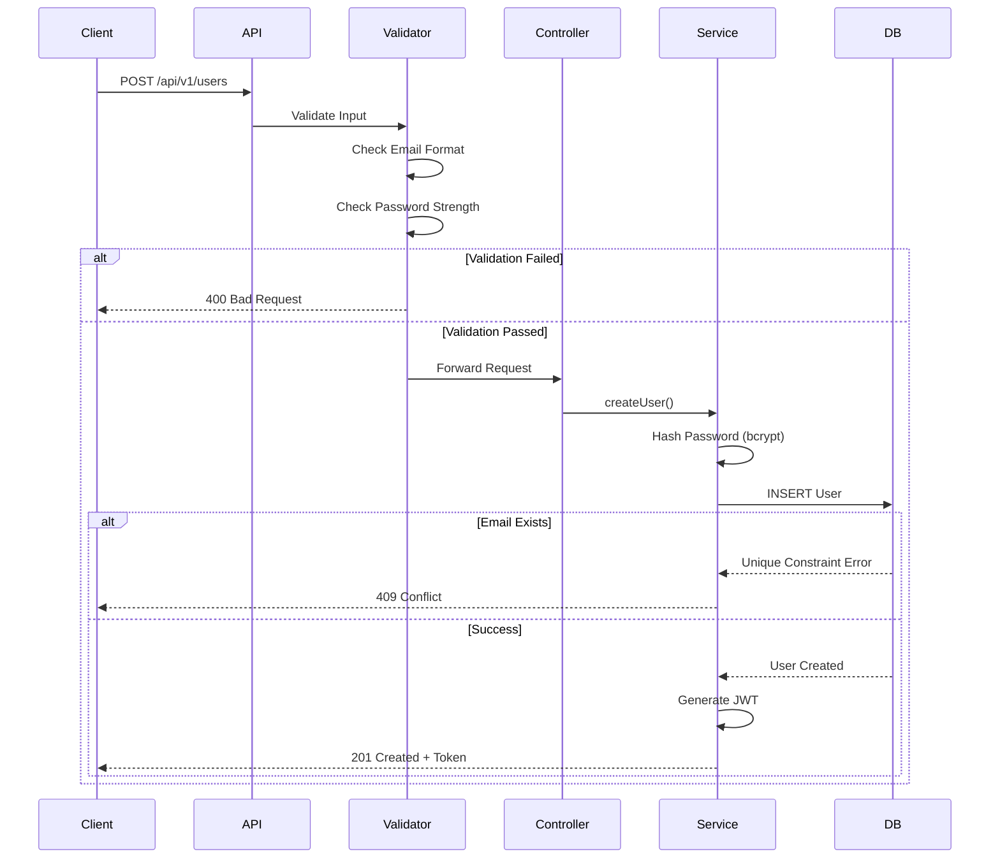

### Produkt erstellen (mit Bild-Upload)

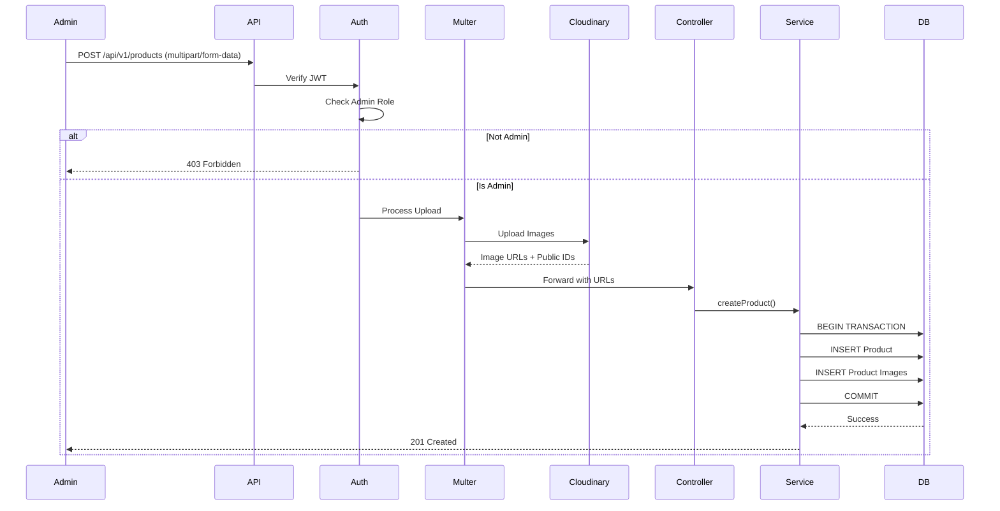

### Bestellung erstellen

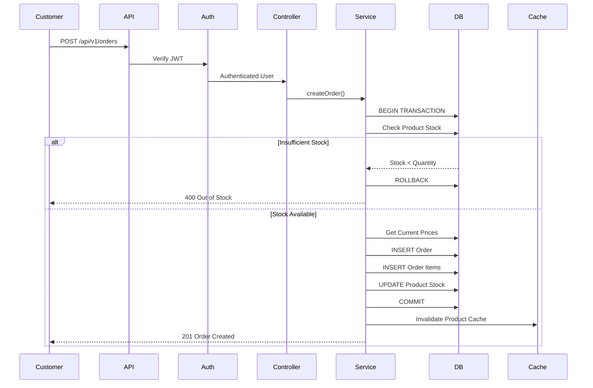

---

## Authentifizierung

### JWT-Authentifizierung Flow

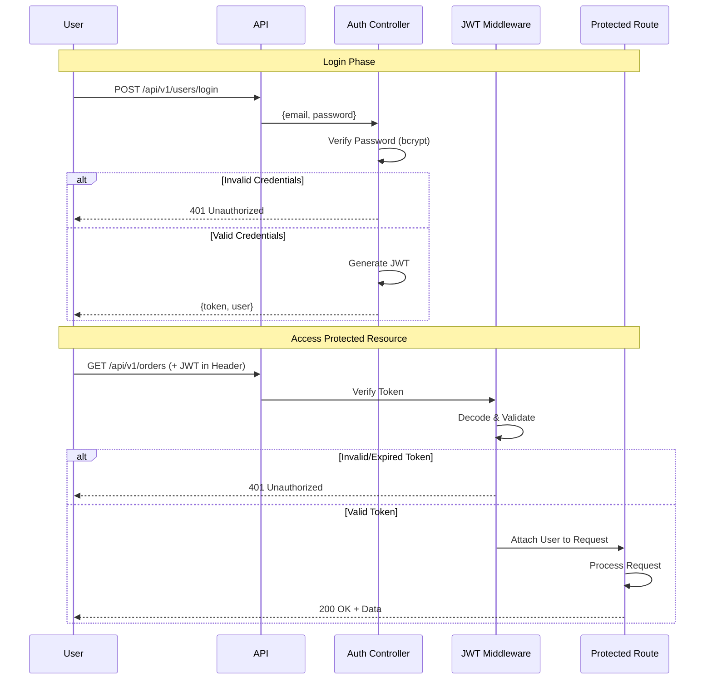

### Passwort-Hashing

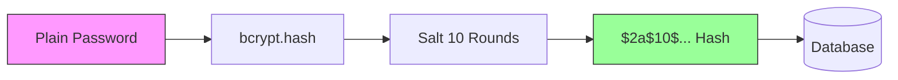

### Authorization (RBAC - Role-Based Access Control)

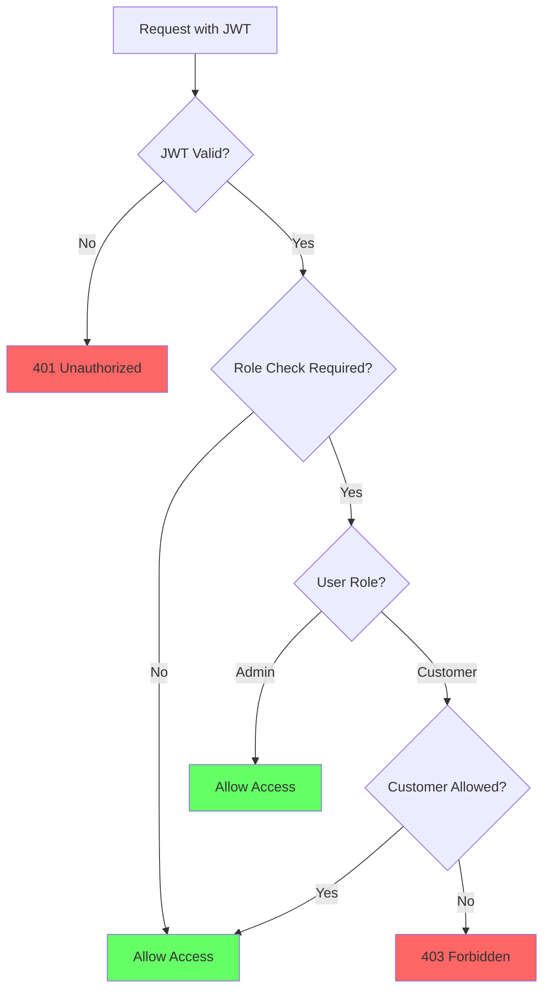

---

## Deployment-Architektur

### Docker-Compose Setup

```mermaid
graph TB
    subgraph "Docker Network: nexus-network"
        subgraph "Application Container"
            A[Node.js App :3000]
        end
        
        subgraph "Database Container"
            B[MySQL 8.0 :3308]
        end
        
        subgraph "Cache Container"
            C[Redis 7 :6380]
        end
        
        subgraph "Admin Tools"
            D[Adminer :8081]
        end
        
        subgraph "External Services"
            E[Cloudinary API]
            F[Sentry Monitoring]
        end
    end
    
    subgraph "Host Machine"
        G[.env File]
        H[Volume: mysql_data]
        I[Volume: redis_data]
    end
    
    A --> B
    A --> C
    A -.-> E
    A -.-> F
    D --> B
    
    G --> A
    G --> B
    G --> C
    
    B --> H
    C --> I
    
    style A fill:#4a90e2
    style B fill:#f39c12
    style C fill:#e74c3c
    style D fill:#9b59b6
    style E fill:#1abc9c
    style F fill:#34495e
```

### Production Deployment

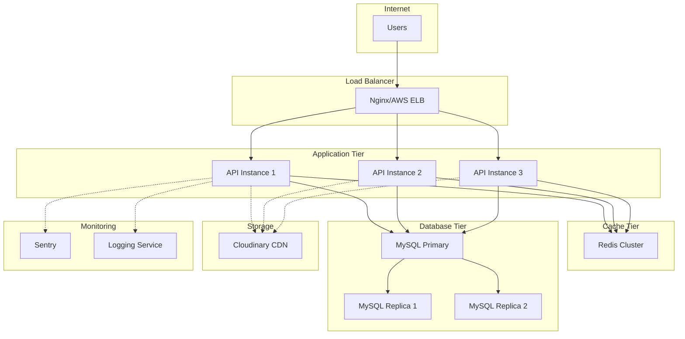

---

## Komponenten-Interaktionen

### Caching-Strategie

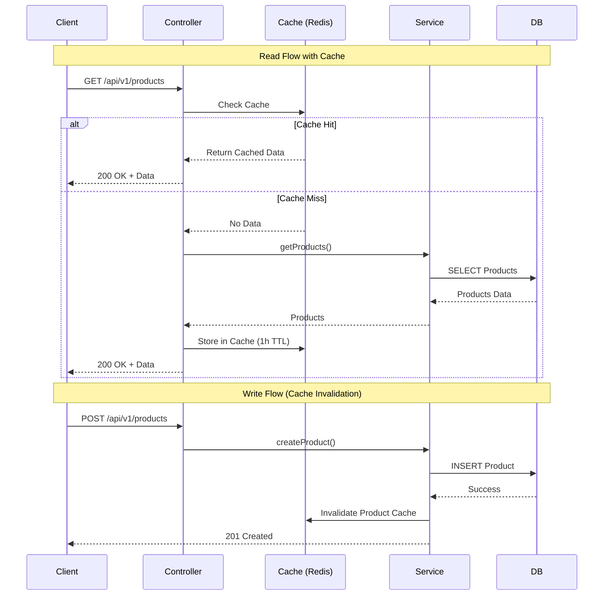

### Fehlerbehandlung

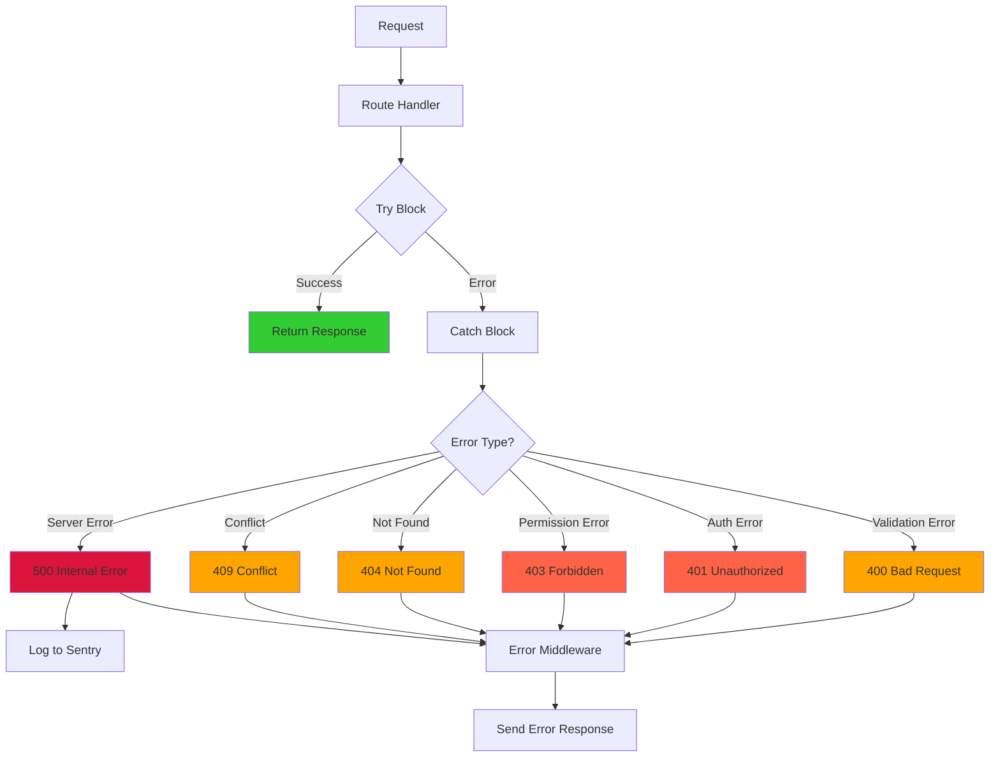

### Request Lifecycle

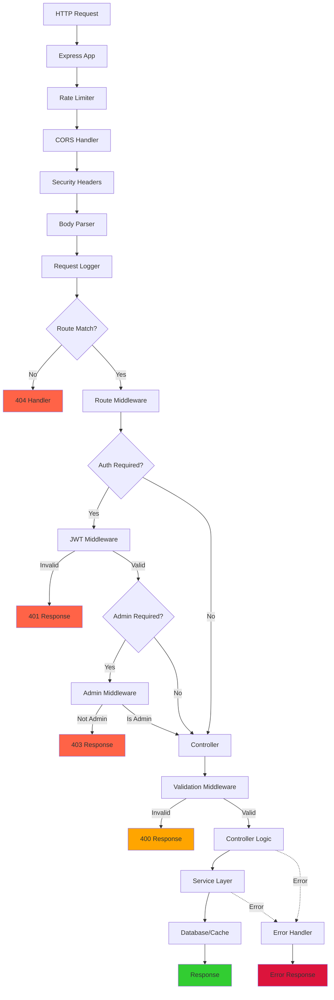

---

## Performance-Optimierungen

### Pagination Flow

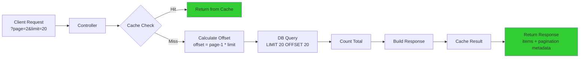

### Indizierung-Strategie

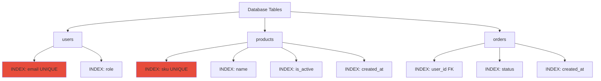

---

## Sicherheits-Features

### Security Layers

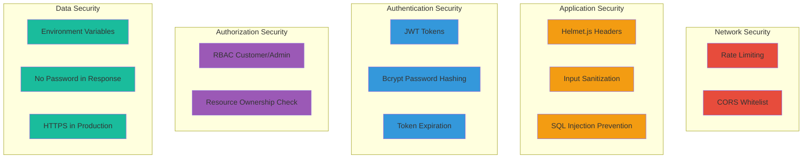

---

## Testing-Architektur

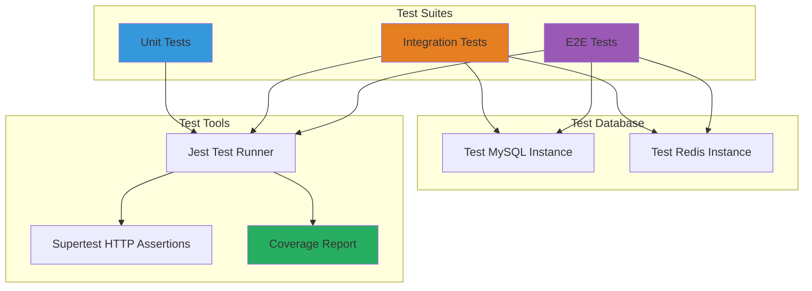

---

## Zusammenfassung

Diese Diagramme zeigen die vollständige Architektur der **Nexus Commerce API**:

### Kernkonzepte

1. **Schichtenarchitektur**: Klare Trennung zwischen Routing, Middleware, Controller, Service und Data Layer
2. **Sicherheit**: Mehrschichtige Sicherheit mit Rate Limiting, JWT, RBAC und Input Validation
3. **Performance**: Redis Caching, Datenbankindizes und Pagination
4. **Skalierbarkeit**: Docker-Container, stateless API, externe Services
5. **Wartbarkeit**: Clean Code, Migrationen, umfassende Tests

### Datenfluss

```
Client → API Gateway → Auth → Validation → Controller → Service → Database
                                                          ↓
                                                     Cache/Storage
```

### Wichtige Dateien

- 📄 `db-diagramm.htm` - Interaktives ER-Diagramm der Datenbank
- 📄 `rest-api-architecture.drawio` - Detaillierte Architektur (Draw.io)
- 📄 `README.md` - Vollständige Projektdokumentation
- 📄 `LERNPLAN.md` - Schritt-für-Schritt Entwicklungsplan

---

**Für weitere Informationen siehe:**
- [README.md](./README.md) - Hauptdokumentation
- [API Dokumentation](http://localhost:3000/api-docs) - Swagger UI (wenn Server läuft)
- [Lernplan](./LERNPLAN.md) - Entwicklungsschritte

---

*Erstellt für das Nexus Commerce API Projekt*
*Letzte Aktualisierung: Januar 2026*
